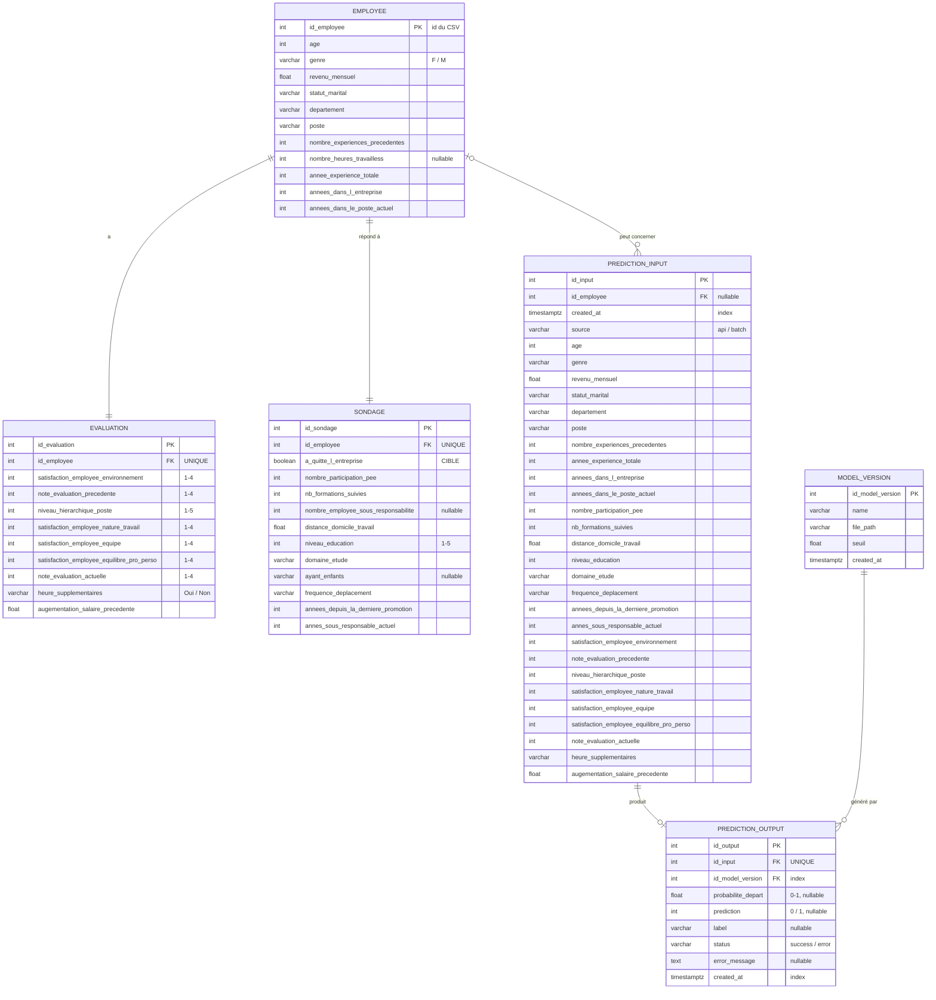

# Schéma de la base de données

Base PostgreSQL locale. Les tables sont définies avec SQLAlchemy dans [`db/models.py`](../db/models.py) et créées par [`db/create_db.py`](../db/create_db.py).



## Choix techniques

| Choix | Pourquoi |
|---|---|
| **3 tables brutes** (`employee`, `evaluation`, `sondage`) | Reflètent les 3 fichiers sources ; seules les données brutes sont stockées, le feature engineering est fait en Python. |
| **Relations 1-1 via `id_employee UNIQUE`** | Un employé a exactement une évaluation et un sondage ; la contrainte UNIQUE l'impose au niveau de la base. |
| **`prediction_input` / `prediction_output` séparées** | Traçabilité : on sait ce qui a été envoyé, ce qui a été répondu, quand, et par quelle version du modèle. |
| **Colonnes typées plutôt que JSON** | La base refuse les valeurs invalides, les requêtes restent simples (`WHERE age > 40`) et le schéma est lisible. |
| **`VARCHAR` + `CHECK` plutôt que `ENUM` PostgreSQL** | Même sécurité (valeur hors liste refusée) mais plus simple à faire évoluer : modifier un `ENUM` PostgreSQL est laborieux. |
| **`status` + `error_message`** | Si le modèle plante, l'input n'est pas « orphelin » : on enregistre l'erreur. Un `CHECK` garantit qu'un succès a une probabilité et qu'une erreur a un message. |
| **`model_version`** | Si le modèle est ré-entraîné (nouveau seuil), les anciennes prédictions restent rattachées au bon modèle. |
| **Index sur `created_at` et les clés étrangères** | Les tables de prédictions grossissent à chaque appel ; les recherches par date ou par version restent rapides. |
| **`DATABASE_URL` dans `.env`** | Aucun mot de passe dans le code ni dans git (`.env` est dans `.gitignore`). |

## Installer PostgreSQL (Ubuntu / WSL)

1. Copier le modèle de configuration, puis remplacer `changeme` par un vrai mot de passe dans `.env` (lettres et chiffres : les caractères spéciaux doivent être encodés, ex. `@` → `%40`) :

```bash
cp .env.example .env
```

2. Installer PostgreSQL si absent, démarrer le service et créer l'utilisateur de `DATABASE_URL` (demande le mot de passe `sudo`) :

```bash
bash db/setup_postgres.sh
```

Relançable sans risque : si l'utilisateur existe déjà, son mot de passe est simplement aligné sur `.env`. Sous WSL, le service ne redémarre pas tout seul : relancer le script (ou `sudo service postgresql start`) après un redémarrage.

## Créer la base

```bash
venv/bin/python -m db.create_db
```

Le script est idempotent (relançable sans erreur) ; `--reset` supprime et recrée les tables.

## Importer le dataset

Les CSV bruts sont dans `data/` (hors git : données RH).

```bash
venv/bin/python -m db.import_csv
```

Conversions de format appliquées (les valeurs ne changent pas) :

| CSV | Base |
|---|---|
| `eval_number` = `"E_123"` | `evaluation.id_employee` = `123` |
| `code_sondage` = `123` | `sondage.id_employee` = `123` |
| `augementation_salaire_precedente` = `"11 %"` | `11.0` |
| `a_quitte_l_entreprise` = `"Oui"` / `"Non"` | `true` / `false` |

L'import vérifie que les 3 fichiers décrivent les mêmes employés, puis insère tout en une seule transaction : si une ligne est refusée, rien n'est inséré. Un second import est refusé ; `--replace` remplace les données (l'historique des prédictions est conservé).

## Vérifier en SQL

[`db/verify.sql`](../db/verify.sql) est en lecture seule. Il affiche les tables, le nombre de lignes (1470 ×3), la jointure des 3 tables, le taux de départ (0.161, et par département), la version du modèle, puis prouve que les contraintes refusent une note hors échelle, une évaluation sans employé et une deuxième évaluation pour le même employé. Il termine par les dernières prédictions.

```bash
psql "$(grep ^DATABASE_URL .env | cut -d= -f2- | sed 's/+psycopg//')" -f db/verify.sql
```

(`psql` ne comprend pas le `+psycopg` propre à SQLAlchemy, d'où le `sed`.)

Pour une session SQL interactive (quitter avec `\q`) :

```bash
psql "$(grep ^DATABASE_URL .env | cut -d= -f2- | sed 's/+psycopg//')"
```

> Testé de bout en bout sur PostgreSQL 16.2 : `setup_postgres.sh`, `create_db` et `import_csv` (deux fois chacun), `import_csv --replace`, `verify.sql`, ainsi que les contraintes des tables de prédictions.

## Traçabilité des appels à l'API

Chaque appel à `POST /predict` passe par la base :

```
requête JSON (données brutes)
  → Pydantic valide (sinon 422, rien n'atteint le modèle)
  → model_version retrouvée ou créée          (base indisponible → 503, pas de prédiction)
  → app/features.py calcule les 10 features  (mêmes formules que le notebook d'entraînement)
  → pipeline.predict_proba
  → prediction_input + prediction_output enregistrés dans UN commit
  → réponse avec id_prediction (= prediction_input.id_input)
```

| Cas | Réponse | En base |
|---|---|---|
| succès | 200 + `id_prediction` | input + output `status='success'` |
| données invalides / feature calculée envoyée | 422 | rien (le modèle n'est pas appelé) |
| erreur du modèle | 500 | input + output `status='error'` avec le message |
| base indisponible ou non configurée | 503 | rien : pas de prédiction sans traçabilité |

Lancer l'API (PostgreSQL démarré, `.env` rempli) puis ouvrir http://127.0.0.1:7861/docs :

```bash
venv/bin/uvicorn app.main:app --port 7861
```

Retrouver un échange à partir de l'`id_prediction` renvoyé (ici 1) :

```sql
SELECT i.*, o.status, o.probabilite_depart, o.prediction, o.label, m.seuil
FROM prediction_input i
JOIN prediction_output o USING (id_input)
JOIN model_version m USING (id_model_version)
WHERE i.id_input = 1;
```

> Testé sur PostgreSQL 16.2 : 2 prédictions enregistrées et visibles dans `verify.sql`, ancien format (feature calculée envoyée) refusé en 422, base arrêtée → 503, sans `DATABASE_URL` → l'API démarre et `/predict` répond 503.
